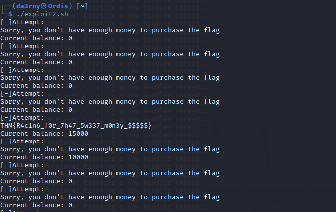

# [Race Conditions](https://tryhackme.com/room/raceconditions)

An intermediate TryHackMe room that aims to solve 3 "race condition" problems in 3 binaries. According to the instructions we shopuld be connected to the machine via SSH using the following credentials:

- User: race
- Password: car

## Walk Flag
We see an executable, a C file which the binary is probably compiled from, and the flag that we need to read. At first glance we see that flag is obviously cannot be read with our permissions.

Next, we take a look to the C file and see a code appears to be a simple program that reads and prints the contents of a file. However, it includes some additional checks to prevent the program from reading sensitive information or symbolic links that contain the word "flag" in the file path.

To test this we create a file called test in our own home directory, and try to read the file with using the "anti_flag_reader" executable. And as I expected we can.

The main flaw in this code is, program sleeps and waits for a character input from the user **after** doing the necesarry checks. We can bypass this by creating a symbolic link between a dummy file and our flag file **after** the checks done and **before** we press a key to proceed with the program. 

## Run Flag
Same as before, we see an executable, a C file which the binary is probably compiled from, and the flag that we need to read.

Firstly, we check the C file contents for the potential race condition flaws and inside the **check_security_contex** function we encounter one. The program sleeps for 500 microseconds after checking if the user that executed to binary can really access the inputted file. 

We can bypass this by creating and deleting a dummy file continuously while creating a symlink between our dummy file and the flag file.

While we are executing our script we should try to read the flag at the right time interval (you can do this via writing another automated script,but the time interval is big enough to get the flag without automation so I got it manually).

## Sprint Flag
Finally, our final user has the same files (an executable, a C file, and the flag) as before.

This time before we check the contents of the C file, firstly we try the executable and we see that it actually is a banking systems that serves on the port 1337. After we connect to the machine thorugh 1337 port we see that we have 3 available commands in use:

- **withdraw**: Withdraws 10000 units from the balance
- **deposit**: Deposits 10000 units to the balance
- **purchase flag**: Checks if there's enough balance in the account (15000) if so then gives us the flag.

One problem here is, you can see from the source code, after depositing 10000 units to the account it nearly instantly (after sleeping for a microsecond) sets the balance to the 0 again. The key word here is **nearly**.

But there is a catch, in the code although every session after you connect to the application, is created by a different thread, the balance is kept universal and not dependent to the corresponding thread. This means if we create enough threads at the same time and try to deposit money into the account, it should eventually be 20000 units even 30000 units in the account. We can exploit this :D.

We execute the script that we wrote 10 times to make our chance higher to exceed the 15000 limit, and also we write another script the purchase the flag simulaneously with our deposit scripts running. 

After a few seconds of trying, our script successfully purchased the flag.

