# [Valley](https://tryhackme.com/room/valleype)

An easy TryHackMe room that aims to sharpen your enumeration and pentest skills.

## User Flag

We connect to the VPN machine servers via OpenVPN. After that we run an extensive scan on the target.

We see the HTTP and SSH services are open on their default ports and an FTP server (vsftpd 3.0.3) is running on port **37370**. We search for an exploit for the FTP server but there is none. Let's look through the HTTP website.

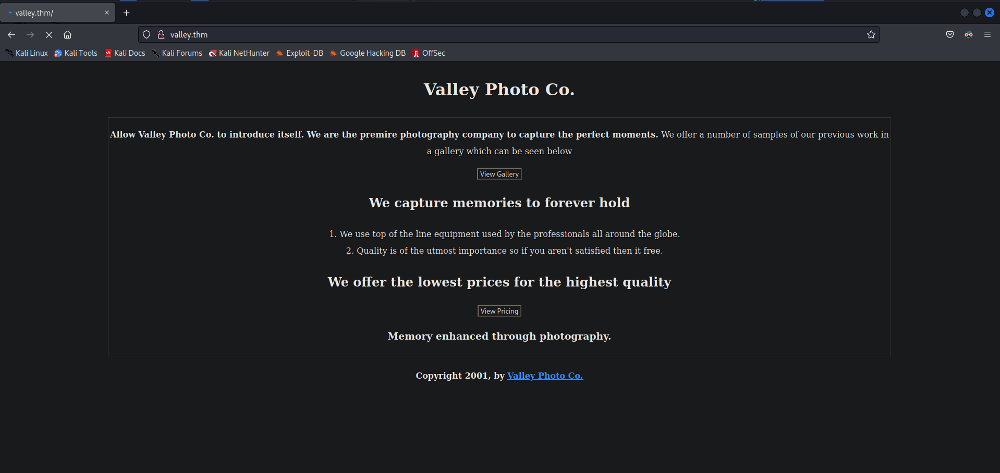

Next we run a directory scan on the website to further enumerate.

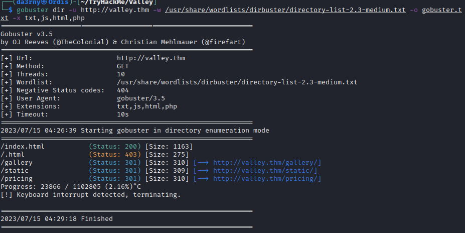

From the scan we discover 3 main directories: gallery, static and the pricing. Gallery and Pricing directories not that important to us because one has random JPEG files that are nothing to do with stenography and the other consists of a useless note.txt file. 

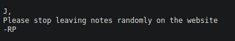

Although, there is no files in the static directory too, when we run a directory scan on the /static, we see a directory named /00. That looks odd from the other ones.

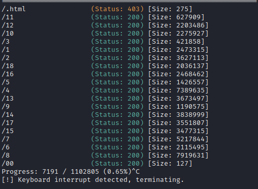

We look to the /00 and we see another note that was left by the devs (don't do this man :D). The note indicates that there is another directory with the name **/dev1243224123123**. Let's look through that.

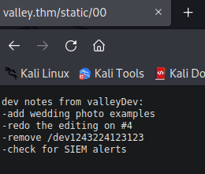

We encounter with a login panel. I tried SQL Injection but didn't work. Then we look through the source code deeply and inside the **dev.js** file we found some credentials. When we try them on the login page we successfully log into the site.

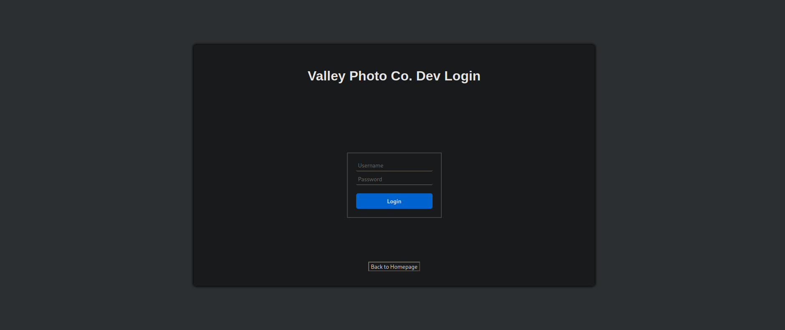
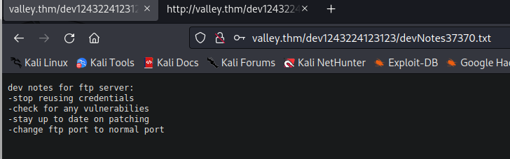

Inside the site we find another note LEFT BY THE DEVS (do you see a pattern here 🤨)
The note exactly says **stop reusing credentials** and talks about the ftp server. We infer from this that we could log into the ftp server with the same username and the password. And indeed we can.

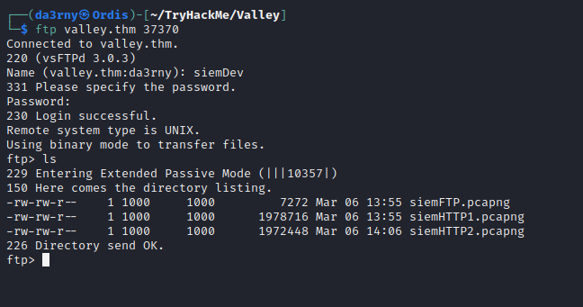

In the FTP server we see 3 pcapng files. After we get and analyze them the only important file is the file that named **siemHTTP2.pcapng**. Inside of it we find a HTTP trace. We follow it and we find some credentials to log in via ssh to the machine.
After we log in to the machine as valleyDev user we acquire the User flag.

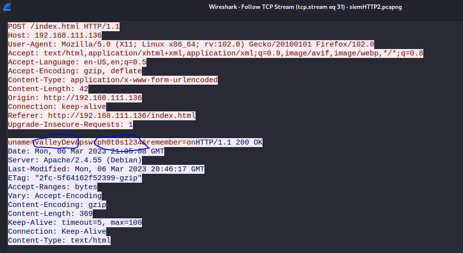
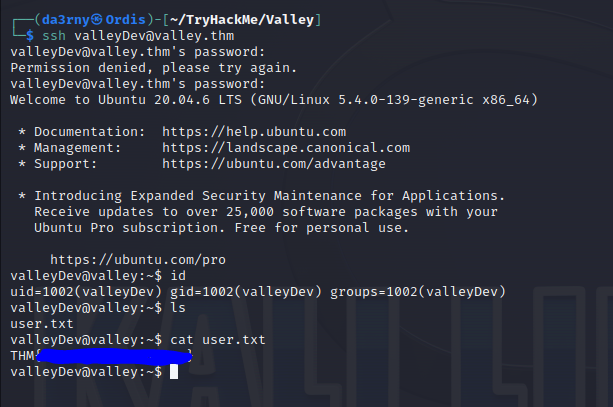

## Root Flag

We can't find much in the valleyDev home directory but in the /home ve found an executable called valleyAuthenticator. We download it to analyze using the SCP tool.
Using the Strings tool we identify the binary is compressed using the UPX method and we can decompress it by using the upx-ucl tool installed in Kali. After that we try to analyze it with Strings one more time and we find two hashed which are seem like md5sum hashes. We crack them using the crackstation and get the following credentials:

- User: valley
- Password: libert123

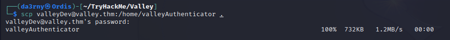
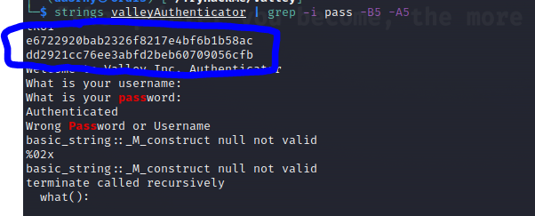
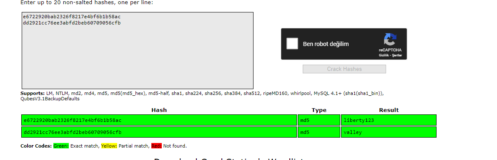

Using this credentials we log with the **valley** user.

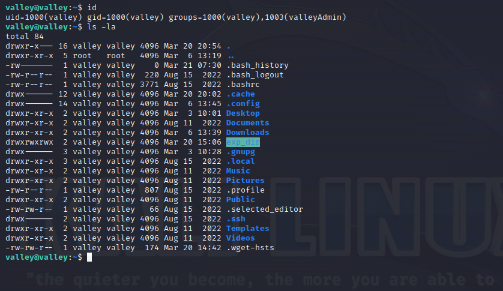

We run linpeas to see possible privilege escalation vectors.

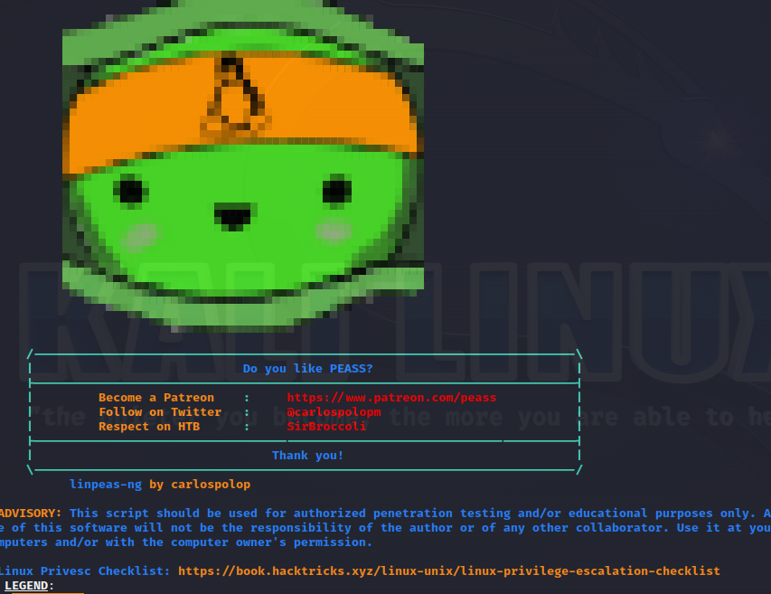

Linpeas finds a python script that runs as a cronjob. Next we analyze the file.

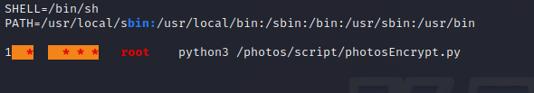
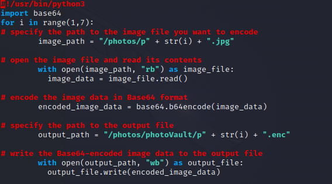

After trying so much things, I decided to try **Python module hijacking**. In this case we can put a reverse shell code inside the default base64.py (Valley user is assigned to the valleyAdmin group and resulting that it can write to the base.64 file arbitrarly) file, so when the Base64 module is called our reverse shell will be run by the other script, in our case that script will be run as the root user and we will get the root shell. base64.py file is located in the /usr/lib/python3.8 directory.

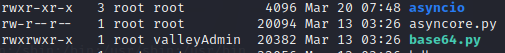

We get the shell and we got the flag!

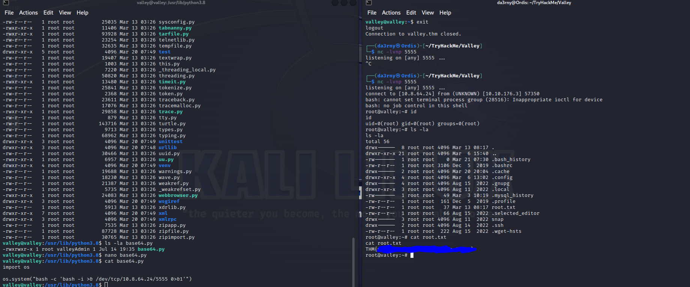